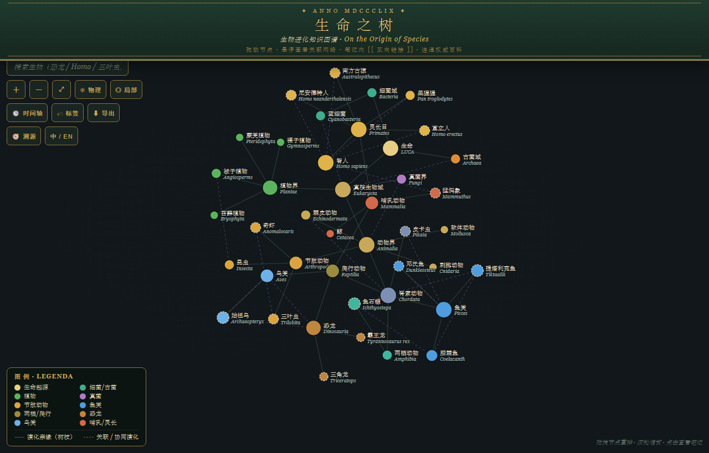
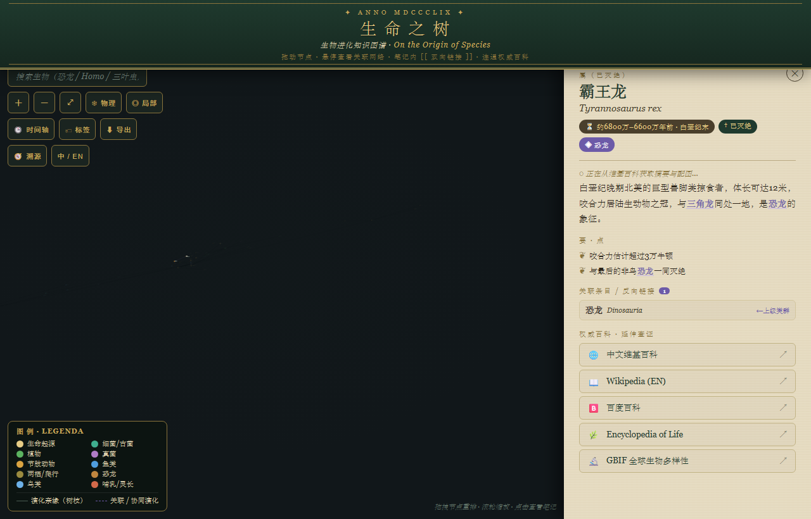
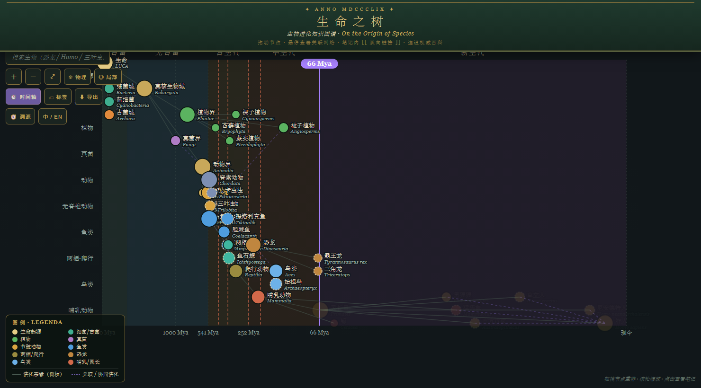
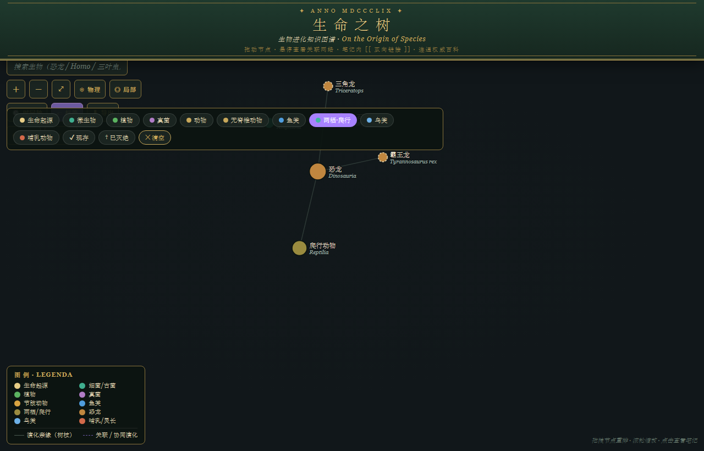

# 生命之树 · 生物进化知识图谱

> *On the Origin of Species* —— 一个连通权威百科的交互式生物演化图谱。
> 从 38 亿年前的末次共同祖先（LUCA）出发，沿着自然选择的枝干，探寻古往今来不同生物的详细信息与彼此的联系。

界面取意于达尔文《物种起源》1859 年初版封面：墨绿底、烫金双线边框、古典衬线字体；交互形态借鉴 Obsidian 的知识图谱——力导向的节点网络、双向链接与反向链接、局部图谱与悬停高亮。



---

## ✨ 功能特性

### 🕸 力导向知识图谱（Obsidian 风格）
- 自写物理引擎（斥力 + 弹簧 + 向心力 + 碰撞分离），节点自由漂浮、**可拖拽**，布局稳定后自动停机省电。
- 节点**大小按连接数**、**颜色按生物类群**（细菌、植物、真菌、节肢、鱼类、两栖爬行、恐龙、鸟类、哺乳…）。
- **悬停高亮**邻接网络、淡化其余；支持**局部图谱**模式。

### 📜 Obsidian 式笔记与双向链接
- 点击节点弹出仿羊皮纸笔记：分类阶元、地质年代、简介、要点。
- 正文中出现的其它物种名自动变为可点击的 **`[[ 双向链接 ]]`**，一键在图谱中跳转。
- **反向链接 / 关联条目**面板：列出上级类群与跨枝关联（如协同演化、过渡化石、共存关系）。



### 🌐 连通权威百科（实时）
- 选中物种即通过 **Wikipedia REST API** 拉取该词条的**摘要首段与缩略图**（按界面语言取中/英文维基）。
- 每个节点附 5 个权威平台直达入口：中文维基百科、英文 Wikipedia、百度百科、Encyclopedia of Life (EOL)、GBIF 全球生物多样性。

### 🕒 地质时间轴
- 切换到时间轴模式后，物种按**首次出现年代**沿对数时间轴排布。
- 背景按**太古宙 / 元古宙 / 古生代 / 中生代 / 新生代**分色，叠加**五次生物大灭绝**标记。
- 一条**可拖动的时间游标**：拖到某年代，当时尚未出现的物种自动淡出，直观呈现"那一刻地球上有什么"。



### 🏷 标签筛选
- 按类群（微生物 / 植物 / 真菌 / 无脊椎 / 鱼类 / 两栖·爬行 / 鸟类 / 哺乳…）与**现存 / 已灭绝**状态多维筛选（取交集）。



### 🧭 演化溯源（MRCA）
- 依次点击两个物种，高亮它们到**最近共同祖先**的完整演化路径，并说明该祖先与年代。

### 其它
- **导出**：高清 PNG 位图 / SVG 矢量图，自带墨绿底与烫金标题。
- **可分享状态**：选中节点、时间轴模式、筛选、语言全部编码进 URL，刷新或分享链接即可还原。
- **中 / EN 双语**界面，节点标签随语言切换（英文模式以学名为主）。
- **无障碍**：节点带 `role / aria-label / tabindex`，支持方向键在邻接物种间导航、Enter 打开、Esc 关闭。
- **触摸手势**：单指拖拽、双指捏合缩放，移动端可用。

---

## 🚀 使用方法

这是一个**零依赖、完全自包含**的单文件应用。

**最简单**：直接用浏览器打开 `evolution-atlas.html` 即可（双击文件）。

> 若发现维基百科摘要/图片不显示，多半是从 `file://` 直接打开时被浏览器安全策略拦截。改用本地服务器访问即可：

```bash
# 在项目目录下任选其一
python -m http.server 8099
#  或
npx serve .
```

然后浏览器访问 `http://localhost:8099/evolution-atlas.html`。

### 操作速览
| 操作 | 方式 |
|---|---|
| 平移 / 缩放 | 拖拽空白处 / 滚轮（移动端：单指拖、双指捏合） |
| 查看详情 | 点击节点 |
| 跳转关联 | 点击笔记中的 `[[链接]]` 或关联条目 |
| 重排节点 | 直接拖动节点 |
| 时间轴 / 标签 / 溯源 / 导出 / 语言 | 左上角工具按钮 |
| 键盘 | 方向键导航、Enter 打开、Esc 关闭 |

---

## 🗂 数据结构

所有数据内联在 `evolution-atlas.html` 内，便于离线使用与单文件分发，并已结构化为几张表，扩充时只需修改这几处：

- `TREE` —— 生命之树主干（嵌套的分类层级，含中文名、学名、阶元、年代、简介、要点、各百科词条名）。
- `ASSOC` —— 跨枝关联边 `[物种A, 物种B, 关系标签]`（协同演化、过渡化石、共存等）。
- `TIME` —— 各物种首次出现年代（百万年前 Mya），用于时间轴。
- `COLOR_MAP` / `COARSE` —— 配色与粗分类标签（用于着色、泳道与筛选）。

收录约 40 个代表性类群，覆盖三域六界、寒武纪大爆发、鱼类登陆、恐龙—鸟类过渡、人族谱系等关键节点。

---

## 🛠 技术

- 纯 **HTML + CSS + 原生 JavaScript**，无构建步骤、无第三方库。
- 力导向布局、SVG 渲染、Canvas 导出、Wikipedia REST API 均为手写实现。

---

## 🧭 后续方向

- 节点直接显示缩略图；大灭绝事件悬停详情。
- 物理引擎升级 Barnes–Hut 四叉树以支持上千节点。
- 扩充物种密度，数据外置为可校对的 JSON / 接入 Wikidata 自动校验分类与年代。
- 深色 / 羊皮纸主题切换。

---

## 📄 许可证

本项目以 [MIT License](LICENSE) 开源。

生物简介、摘要与配图来源于维基百科（Wikipedia / 维基百科），遵循 **CC BY-SA** 许可；外部百科链接版权归各平台所有。
